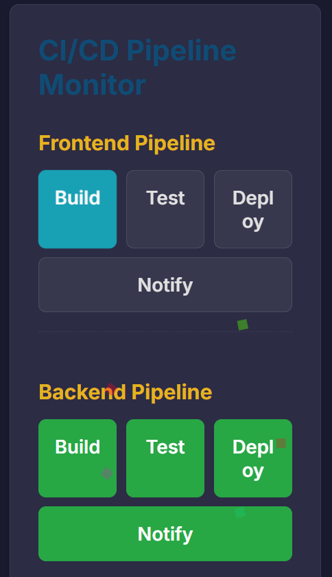
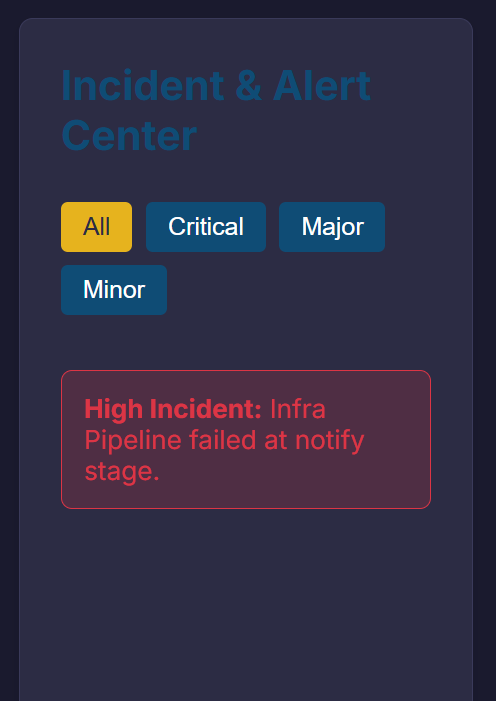
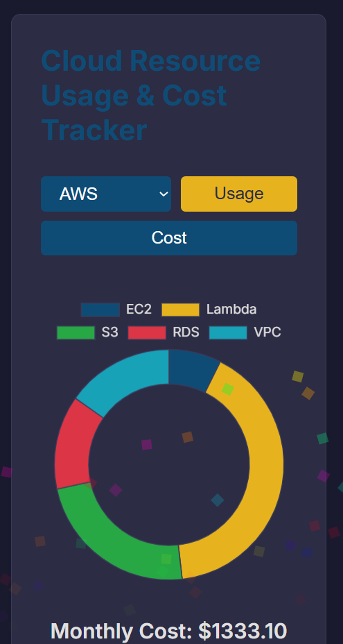
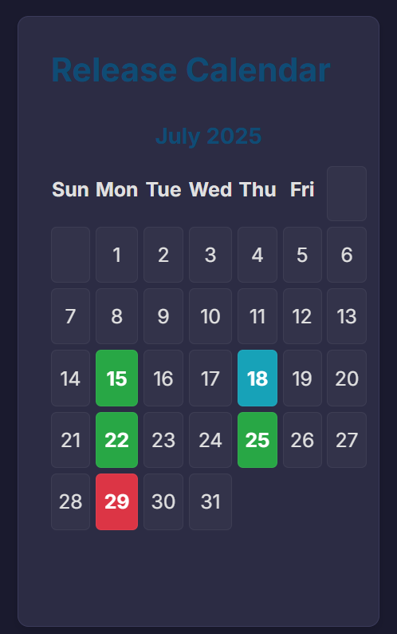
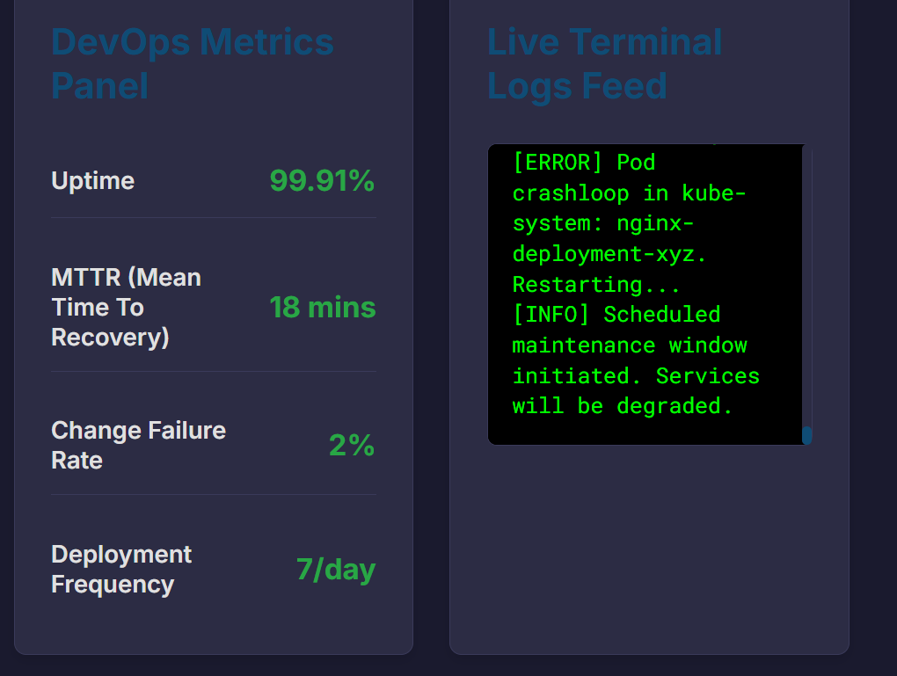
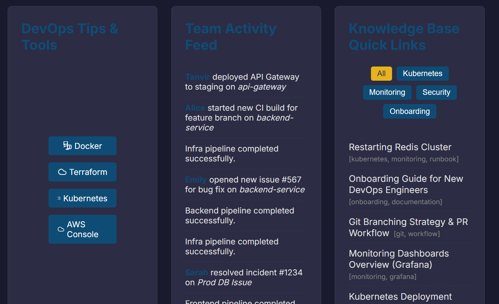

# 🚀 DevOpsBoard

**DevOpsBoard** is a fully frontend-only, interactive DevOps dashboard — built using only **HTML**, **CSS**, and **JavaScript** — designed to simulate a real-world DevOps/SRE control room.

It mimics a live internal intranet dashboard used by DevOps and cloud teams to monitor CI/CD pipelines, track incidents, visualize cloud costs, observe deployment schedules, and more — without relying on any backend or API.

🖥️ **Live Demo:** [https://devopsboard.netlify.app/](https://devopsboard.netlify.app/)

🎯 **Built for:** [DEV Frontend Challenge: Office Edition (Holistic WebDev Prompt)](https://dev.to/devteam/announcing-our-frontend-challenge-office-edition-2c9m)

---

## 🔍 Preview

Here are some screenshots of DevOpsBoard in action:

| CI/CD Pipeline Monitor | Incident Alert Center |
|------------------------|------------------------|
|  |  |

| Cloud Resource Dashboard | Deployment Calendar |
|--------------------------|----------------------|
|  |  |

| Metrics + Logs | Tips & Tools |
|----------------|---------------|
|  |  |

---

## 🧠 Features

✅ CI/CD Pipeline Monitor (Frontend, Backend, Infra)  
✅ Incident & Alert Center with Modal Details  
✅ Cloud Resource Usage + Cost Tracker (AWS, Azure, GCP simulation)  
✅ Release Calendar with Deployment Tags (Staging, Production, Hotfix)  
✅ Realistic DevOps Metrics (Uptime, MTTR, CFR, etc.)  
✅ Live Terminal Log Feed  
✅ Daily DevOps Tips + External Tools Panel  
✅ Team Activity Feed  
✅ Knowledge Base Quick Links with Tags  
✅ Command Cheatsheet (AWS CLI, Git, Docker, K8s)  
✅ Test Coverage Snapshots with Trend Indicators  
✅ Light/Dark Mode Toggle ("Day Ops" / "Night Watch")  
✅ Drag-and-drop widget layout (experimental)

---

## 📦 Tech Stack

- HTML5
- CSS3 (CSS Variables, Flexbox, Grid, Dark Mode)
- JavaScript (Vanilla DOM, Animations, Intervals)
- Chart.js (for resource graphs)
- Fully frontend — **no backend, no database, no APIs**

---

## 🎯 Why This Project?

Most dashboards focus on UI for customers or marketing. **DevOpsBoard** flips the focus to **internal engineering culture** — giving developers and SREs a beautiful, fast, and practical home base. It’s built to show how much you can simulate with **just frontend technologies**, while still delivering serious value.

---

## 📚 Dev.to Submission

Submitted under: **Holistic WebDev: Office Space** prompt  
🔗 DEV Challenge Link: [View Submission →](https://dev.to/devteam/announcing-our-frontend-challenge-office-edition-2c9m)  
🏷️ Tags: `#frontendchallenge`, `#webdev`, `#devops`, `#cloud`, `#html`, `#javascript`

---

## 🙋‍♂️ Author

**Prashant Gohel**  
👨‍💻 Cloud & DevOps Enthusiast | Aspiring DevOps Engineer  
🌐 [Portfolio](https://devopsboard.netlify.app/) | [LinkedIn](www.linkedin.com/in/prashantgohel1706)

---